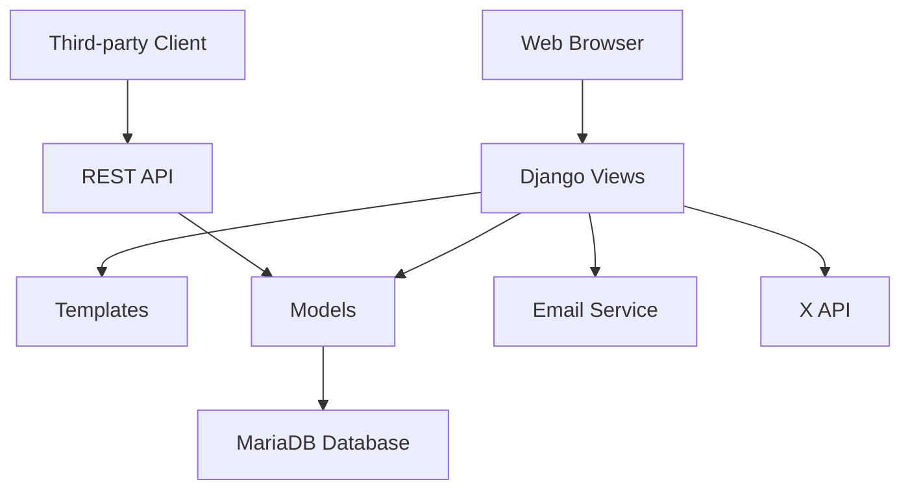

# News App Design Plan

## 1. What the App Must Do

### User Management
- People can join with jobs: Reader, Editor, Journalist
- Special user model with job-based fields
- System for login and rights
- People get groups with right permissions

### Content Management
- Journalists can make articles and newsletters
- Editors can check and approve articles
- Articles go by email to subscribers when approved
- Articles go to X (Twitter) when approved

### Subscription System
- Readers can subscribe to publishers and single journalists
- Subscriptions decide what content they see

### API
- RESTful API for outside clients to get articles based on subscriptions
- Login needed for API use

### Permissions
- Reader: See articles and newsletters
- Editor: See, change, delete articles and newsletters
- Journalist: Make, see, change, delete articles and newsletters

## 2. Other Needs

### Performance
- Answer time less than 2 seconds for article getting
- Support up to 10,000 users at the same time

### Security
- Safe login using Django's auth system
- Rights-based access control
- Input check and cleaning

### Usability
- Easy web interface
- Works on mobile and desktop
- Clear navigation and user feedback

### Maintainability
- Code in parts
- Full documents
- Unit tests for key functions

### Scalability
- Database design allows growth
- API made for outside joining

## 3. Database Design

### Normalization
The database is normalized to 3NF to cut out repeats and keep data good.

#### Tables

**CustomUser** (extends Django's User)
- id (PK)
- username
- email
- role (Reader/Editor/Journalist)
- subscribed_publishers (M2M to Publisher)
- subscribed_journalists (M2M to CustomUser)
- independent_articles (M2M to Article)
- independent_newsletters (M2M to Newsletter)

**Publisher**
- id (PK)
- name
- editors (M2M to CustomUser)
- journalists (M2M to CustomUser)

**Article**
- id (PK)
- title
- content
- author_id (FK to CustomUser)
- publisher_id (FK to Publisher, can be empty)
- approved (yes/no)
- published_date (datetime)

**Newsletter**
- id (PK)
- title
- content
- publisher_id (FK to CustomUser)
- published_date (datetime)

### Relationships
- CustomUser -> Publisher (M2M subscriptions)
- CustomUser -> CustomUser (M2M journalist subscriptions)
- Publisher -> CustomUser (M2M editors/journalists)
- CustomUser -> Article (FK author)
- Article -> Publisher (FK, can be empty)
- CustomUser -> Newsletter (FK publisher)

## 4. UI/UX Design

### User Interface
- Clean, modern look using Bootstrap/CSS
- Works on all devices
- Same navigation bar
- Clear action buttons

### User Experience
- Simple join/login process
- Dashboard shows content based on job
- Easy subscription management
- Simple article approval for editors

### Wireframes

#### Reader Dashboard
- List of subscribed articles
- Subscription management
- Profile settings

#### Editor Dashboard
- Pending articles for approval
- Approved articles management
- User management

#### Journalist Dashboard
- Make new article/newsletter
- Manage published content
- Analytics (later)

#### Article Detail View
- Full article content
- Author information
- Related articles

## 5. API Design

### Endpoints
- GET /api/articles/ - Get articles based on user subscriptions
- Login: Token-based or session

### Response Format
```json
{
  "id": 1,
  "title": "Article Title",
  "content": "Article content...",
  "author": "Author Name",
  "publisher": "Publisher Name",
  "published_date": "2023-01-01T00:00:00Z"
}
```

### Authentication
- Users must log in to use API
- API gives only articles from subscribed publishers/journalists

## 6. System Architecture



### Components
- **Frontend**: HTML/CSS/JavaScript templates
- **Backend**: Django views, models, forms
- **Database**: MariaDB with normalized schema
- **External Services**: Email (SMTP), X API
- **API**: RESTful interface for third-party access

## 7. Security Considerations

- CSRF protection on forms
- SQL injection stop via ORM
- Permission checks on all views
- Safe password storage
- Input check on all user inputs

## 8. Testing Strategy

- Unit tests for models and views
- Integration tests for API endpoints
- Manual testing for UI/UX
- Performance testing for scalability

This design makes a strong, growing news app that meets all needs while keeping good software ways.